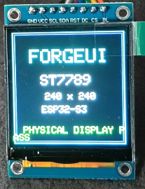

# ForgeUI Hardware Lab — ST7789 240×240 Square Display

A physically tested ESP32-S3 reference for a 1.54-inch square SPI TFT using the ST7789 controller at its native 240×240 resolution. It is a minimal, known-good display bring-up baseline from the ForgeUI Hardware Lab.



## PHYSICAL DISPLAY PASS

Physically tested on **19 September 2026**.

- Display power and backlight passed.
- ST7789 initialization passed.
- Full-screen **RED**, **GREEN**, **BLUE**, **CYAN**, and **YELLOW** fills passed.
- The complete 240×240 viewport rendered correctly, with no observed cropping or offset.
- The ForgeUI physical-pass screen rendered correctly.
- PlatformIO build: **PASS**.
- Firmware flash: **PASS**.

## Hardware identification

- Board: ESP32-S3 DevKitC-1
- Display: 1.54-inch square TFT, ST7789 controller
- Interface: SPI
- Native resolution: 240×240
- PCB marking: `1.54TFT-SPI-ST7789 Ver:1.1`

## Physically proven wiring

| Display | ESP32-S3 |
| --- | --- |
| GND | GND |
| VCC | 3.3V |
| SCL / SCLK | GPIO12 |
| SDA / MOSI | GPIO11 |
| RES / RST | GPIO10 |
| DC | GPIO9 |
| CS | GPIO8 |
| BLK | 3.3V |

MISO is not used.

### Backlight note

For **this** tested 240×240 module, **BLK → 3.3V is physically proven**. Do not inherit the `BL → GND` wiring used by the separate 76×284 display reference.

## Proven display configuration

The supplied firmware uses Arduino_GFX with ESP32 HSPI, CS on GPIO8, and an ST7789 configured for a 240×240 viewport. The source is intentionally a small physical bring-up: it runs the colour-fill sequence and then holds the ForgeUI physical-pass screen.

## Software and build baseline

- PlatformIO
- `espressif32@6.7.0`
- `esp32-s3-devkitc-1`
- Arduino framework
- Arduino-ESP32 2.0.16, as resolved by the pinned platform
- Arduino_GFX 1.3.7

Arduino_GFX is intentionally pinned at 1.3.7: a newer unpinned version produced an `esp32-hal-periman.h` compatibility failure in this environment.

## Build and upload

Use PlatformIO with the pinned project configuration:

```sh
pio run
pio run --target upload
pio device monitor
```

## ForgeUI Hardware Lab

This is a physically tested [ForgeUI](https://forgeui.co.nz) Hardware Lab baseline. It is deliberately focused on reliable display bring-up and may support future square-display experiments and [ForgeUI Studio](https://studio.forgeui.co.nz) examples.

## External reference and dependency attribution

The initial investigation used the external reference project [kursatEcinni/esp32s3-st7789-test](https://github.com/kursatEcinni/esp32s3-st7789-test), which helped establish useful initial ESP32-S3/ST7789 information. It remains an independent project; ForgeUI does not own it. This repository contains its own minimal physical bring-up and does not copy that project's branding or unrelated LVGL material.

[Arduino_GFX](https://github.com/moononournation/Arduino_GFX) is the external display-library dependency. It remains the property of its respective authors and is subject to its own license.

## Scope and license

This repository documents one physically tested ESP32-S3 and ST7789 240×240 module combination. Other modules, controllers, revisions, and wiring arrangements should be validated independently.

Released under the [MIT License](LICENSE).
